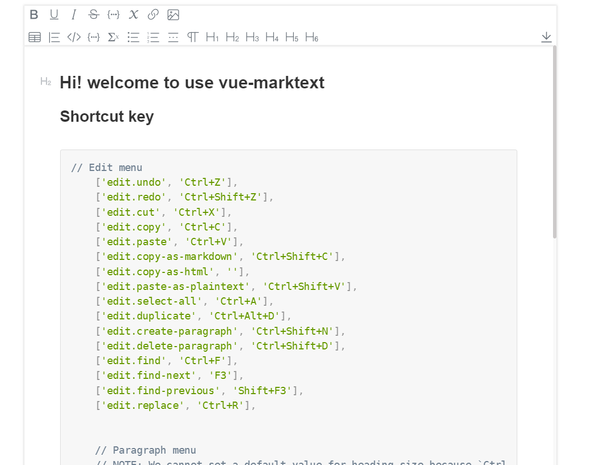

# vue-marktext

- [vue-marktext](#vue-marktext)
  - [Install](#install)
  - [Use](#use)
    - [Global component](#global-component)
    - [Local component](#local-component)
  - [Show](#show)
  - [Component props options](#component-props-options)
    - [Example](#example)
  - [Component defineExpose Method](#component-defineexpose-method)
    - [Example](#example-1)
  - [Component Events](#component-events)
  - [Muya Editor](#muya-editor)


## Install

```shell
npm install vue3-marktext --save
```


## Use

### Global component

```js
import VueMarktext from 'vue3-marktext'
createApp(App).use(VueMarktext)
```

### Local component

```js
import {VueMarktext} from 'vue3-marktext'

export default defineComponent({
  components: {
	VueMarktext
  },
})
```

## Show


## Component props options

| prop          | descrition                                        | type    | default                |
| ------------- | ------------------------------------------------- | ------- | ---------------------- |
| markdown      | initial markdown string                           | string  | Welcome to use muya... |
| fontSize      | fontSize for editor(to new Muya(element,{}))      | number  | 16                     |
| lineHeight    | line height                                       | number  | 1.6                    |
| tabSize       | Tab key size(How many spaces does a tab key have) | number  | 4                      |
| isHtmlEnabled | html enabled                                      | Boolean | true                   |

### Example

```html
<template>
    <div>
        <vue-marktext 
            ref="marktextRef" 
            :markdown="'## Hi!'"
            :tabSize="2"/>
    </div>
</template>
```


## Component defineExpose Method

| Method        | descrition                                                   |
| ------------- | ------------------------------------------------------------ |
| getMarkdown() | get current Markdown text                                    |
| blurEditor()  | blur current Editor                                          |
| focusEditor() | focus current Editor                                         |
| getEditor()   | get Muya Editor(marktext core editor),You can do more operations through the Muya editor(marktext core editor). |

### Example

```html
<template>
    <div>
        <vue-marktext 
            ref="marktextRef" 
            :markdown="'## Hi!'"
            :tabSize="2"/>
    </div>
</template>


<script setup>
import Muya from 'vue3-marktext/src/muya/lib/index';
import { onMounted,ref} from 'vue';
//component instance
const marktextRef = ref()

onMounted(()=>{
    //focus Editor
    marktextRef.value.focusEditor()
    //getMarkdown
    marktextRef.value.getMarkdown()
    //Muya Editor instance
    let editor = marktextRef.value.getEditor()
    
    
    if(editor instanceof Muya){
        //you can through Muya Editor to getMarkdown
        editor.getMarkdown();
       	//control editor to copy markdown As Html(Editor Behavior)
        editor.copyAsHtml()
    }
})

</script>
```

## Component Events

| event  | description                            | params        |
| ------ | -------------------------------------- | ------------- |
| change | When any state of Muya Editor changes. | (change: any) |


## Muya Editor

marktext：[marktext/marktext: 📝A simple and elegant markdown editor, available for Linux, macOS and Windows. (github.com)](https://github.com/marktext/marktext)

muya：[marktext/muya: Future markdown editor for web browser applications development (github.com)](https://github.com/marktext/muya)


